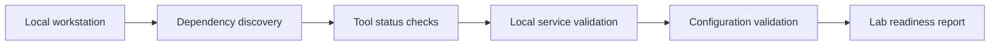

# Architecture

## Two-dimensional line map

```text
                              VALIDATION DIMENSION
                 TOOL -------- SERVICE -------- CONFIG
                   |              |               |
VS Code ---------- Installed ----- Running ------- Extensions
                   |              |               |
Ollama ----------- Installed ----- Local API ----- Models
                   |              |               |
Security Tools --- Available ----- Isolated ------ Authorized scope

GOVERNANCE AXIS: Authorization | Source | Integrity | Resource | Evidence
```

## Component flow



## Design safeguards

- Prefer validation before installation.
- Verify package sources and hashes.
- Bind local AI services only to intended interfaces.
- Keep scan output, packet captures, credentials, and private prompts out of Git.
- Do not automate testing against third-party systems.
